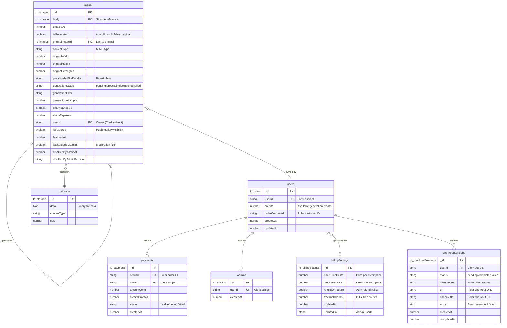
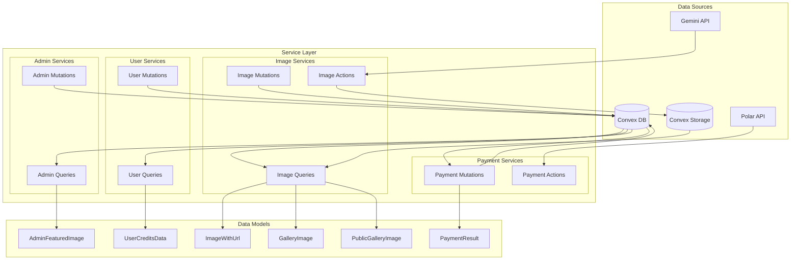
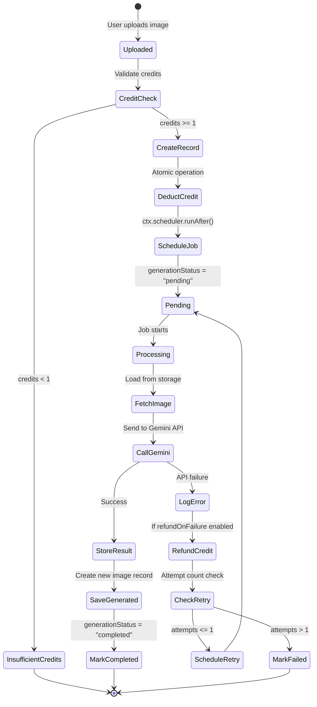
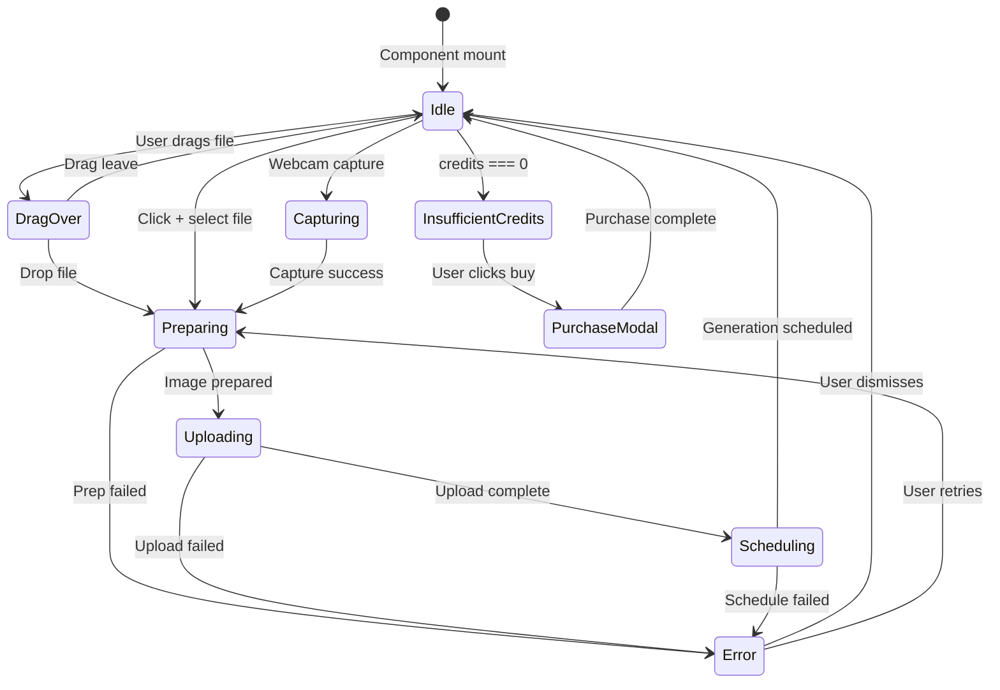

# Data Model Documentation

## Overview

This document provides comprehensive Entity Relationship Diagrams (ERDs) for Anime Leak's data architecture, covering three key layers:

1. **Database Schema** - Core data entities stored in Convex
2. **Service Models** - Backend data transformations and business logic
3. **UI Data Structures** - Frontend-consumed data shapes

---

## 1. Database Schema (Convex)

The database schema defines all persistent data entities in Convex with their relationships and indexes.

### Entity Relationship Diagram



### Key Relationships

1. **Self-Referential: images ↔ images**
   - Original images link to their AI-generated results via `originalImageId`
   - One original can have one generated result
   - `isGenerated` flag distinguishes originals (false) from results (true)

2. **User Ownership: users → images**
   - Each image is owned by a user (via Clerk `userId`)
   - Supports backward compatibility (older images may lack `userId`)
   - Enables per-user galleries and credit tracking

3. **Storage: images → _storage**
   - Each image references a blob in Convex Storage via `body` field
   - Storage handles file persistence and URL generation

4. **Credits & Payments: users ↔ payments**
   - Users have credit balance (`credits` field)
   - Payments record credit purchases (Polar integration)
   - Idempotent processing via `orderId` unique index

5. **Admin System: users ⇄ admins**
   - Admins are users with elevated privileges
   - Separate table for role-based access control
   - Can moderate featured gallery content

### Important Indexes

**Performance-Critical Indexes:**

```typescript
// images table indexes
"by_is_generated" ["isGenerated"]
"by_originalImageId" ["originalImageId"]
"by_generation_status" ["generationStatus"]
"by_is_generated_and_status" ["isGenerated", "generationStatus"] // Compound
"by_userId" ["userId"]
"by_userId_and_createdAt" ["userId", "createdAt"] // Per-user ordering
"by_userId_and_isGenerated_and_createdAt" ["userId", "isGenerated", "createdAt"]
"by_userId_and_generationStatus" ["userId", "generationStatus"]
"by_isFeatured_and_isDisabledByAdmin_and_featuredAt" ["isFeatured", "isDisabledByAdmin", "featuredAt"]

// users table indexes
"by_userId" ["userId"] // Primary lookup
"by_polarCustomerId" ["polarCustomerId"]

// payments table indexes
"by_orderId" ["orderId"] // Idempotency check
"by_userId" ["userId"]

// admins table indexes
"by_userId" ["userId"]

// checkoutSessions table indexes
"by_userId" ["userId"]
"by_status" ["status"]
```

### Field Specifications

**Generation Status Flow:**
```
pending → processing → completed (success)
                     ↘ failed (error)
```

**Image Types:**
- **Original** (`isGenerated: false`): User-uploaded image awaiting transformation
- **Generated** (`isGenerated: true`): AI-transformed result

**Credit System:**
- Each generation costs 1 credit (deducted atomically before processing)
- Failed generations trigger auto-refund (if `billingSettings.refundOnFailure` enabled)
- Free trial grants initial credits on first user creation

---

## 2. Service Models (Backend Data Transformations)

Service models describe how raw database entities are transformed by backend functions into enriched data structures.

### Service Layer Architecture



### Key Service Models

#### 1. ImageWithUrl Model

**Transformation:** `Doc<"images">` + Storage URL → `ImageWithUrl`

```typescript
// Raw database document
type ImageDoc = {
  _id: Id<"images">;
  body: Id<"_storage">;
  createdAt: number;
  isGenerated?: boolean;
  originalImageId?: Id<"images">;
  generationStatus?: "pending" | "processing" | "completed" | "failed";
  userId?: string;
  isFeatured?: boolean;
  // ... other fields
}

// Enriched service model
type ImageWithUrl = ImageDoc & {
  url: string; // Generated from ctx.storage.getUrl(body)
}
```

**Service Function:** `mapImagesToUrls(ctx, images[])`

**Purpose:** Batch-converts storage IDs to accessible URLs for frontend consumption

---

#### 2. GalleryImage Model

**Transformation:** Database → Filter → Enrich → `GalleryImage[]`

```typescript
type GalleryImage = ImageWithUrl & {
  // All image fields plus URL
  // Filtered to show:
  // - Generated images (isGenerated: true)
  // - Pending/processing originals (placeholders)
  // - Excludes: completed originals, failed images
}
```

**Service Functions:**
- `getGalleryImagesPaginated()` - Paginated per-user gallery
- `getGalleryImages()` - Legacy full gallery fetch

**Business Logic:**
- User-scoped (only owner's images)
- Real-time status updates (reactive queries)
- Smart filtering for UX (show placeholders during processing)

---

#### 3. PublicGalleryImage Model

**Transformation:** Featured images → Filter moderation → `PublicGalleryImage[]`

```typescript
type PublicGalleryImage = ImageWithUrl & {
  isFeatured: true;
  isDisabledByAdmin: false;
  // Sorted by featuredAt (desc)
}
```

**Service Function:** `getPublicGallery()`

**Business Logic:**
- No authentication required
- Admin moderation filtering
- Showcase-quality transformations only

---

#### 4. UserCreditsData Model

**Transformation:** User record + Business rules → `UserCreditsData`

```typescript
type UserCreditsData = {
  credits: number;
  hasFreeTrial: boolean; // Computed field
}

// Free trial logic:
// 1. Account age < 7 days AND
// 2. No payment history
```

**Service Function:** `getCurrentUserCredits()`

**Business Logic:**
- On-demand user creation (lazy initialization)
- Free trial status calculation
- Credit balance with real-time updates

---

#### 5. PaymentResult Model

**Transformation:** Polar webhook → Validation → Credit grant → `PaymentResult`

```typescript
type PaymentResult = {
  granted: number; // Credits granted
  skipped: boolean; // Idempotency flag
}
```

**Service Function:** `processPaidOrder()`

**Business Logic:**
- Idempotent order processing (check `payments.by_orderId`)
- Atomic credit balance update
- Quantity-based credit calculation
- Polar customer ID linkage

---

#### 6. Generation Flow Model

**State Machine:** Image generation lifecycle



**Key Service Functions:**
1. `uploadAndScheduleGeneration()` - Entry point (mutation)
2. `generateImage()` - AI processing (internal action)
3. `saveGeneratedImage()` - Persist result (mutation)
4. `updateImageStatus()` - Status tracking (mutation)
5. `refundCreditsForFailedGeneration()` - Error handling (mutation)

---

## 3. UI Data Structures

UI data structures represent the final shape of data consumed by React components.

### Frontend Data Flow

```mermaid
graph LR
    subgraph "Convex Queries (useQuery)"
        Q1[getGalleryImagesPaginated]
        Q2[getPublicGallery]
        Q3[getCurrentUserCredits]
        Q4[hasActiveGenerations]
        Q5[getFailedImages]
    end

    subgraph "React State"
        S1[allGalleryImages]
        S2[publicImages]
        S3[creditsData]
        S4[paginationOpts]
        S5[selectedImage]
    end

    subgraph "UI Components"
        C1[ImagePreview]
        C2[PublicGallery]
        C3[CreditBalance]
        C4[ImageModal]
        C5[Webcam]
    end

    Q1 -->|ImageWithUrl[]| S1
    Q2 -->|PublicGalleryImage[]| S2
    Q3 -->|UserCreditsData| S3
    Q4 -->|boolean| S1
    Q5 -->|FailedImage[]| S1

    S1 --> C1
    S2 --> C2
    S3 --> C3
    S1 --> C4
    S5 --> C4
```

### Component Data Models

#### 1. ImagePreview Component

**Props:**
```typescript
type ImagePreviewProps = {
  images: GalleryImageType[]; // From getGalleryImagesPaginated
  totalImages: number; // From getGalleryImagesCount
  onLoadMore: () => void;
  hasMore: boolean;
  isLoading: boolean;
  onDeleted: (imageId: Id<"images">) => void;
}

type GalleryImageType = {
  _id: Id<"images">;
  _creationTime: number;
  body: Id<"_storage">;
  createdAt: number;
  isGenerated?: boolean;
  originalImageId?: Id<"images">;
  generationStatus?: "pending" | "processing" | "completed" | "failed";
  url: string; // Required for display
  placeholderBlurDataUrl?: string; // For blur-up effect
  originalWidth?: number;
  originalHeight?: number;
  contentType?: string;
  isFeatured?: boolean;
  userId?: string;
}
```

**Derived State:**
```typescript
// Pagination management
const [paginationOpts, setPaginationOpts] = useState({
  numItems: 12, // Base page size (adjusted for 4-column grid)
  cursor: null | string
});

// Accumulated results
const [allGalleryImages, setAllGalleryImages] = useState<GalleryImageType[]>([]);

// Smart merge logic:
// - cursor === null → Replace all (handles new uploads & deletions)
// - cursor !== null → Append deduplicated results
```

---

#### 2. PublicGallery Component

**Props:**
```typescript
type PublicGalleryProps = {
  // No props - self-contained component
}

type PublicGalleryImage = {
  _id: Id<"images">;
  _creationTime: number;
  body: Id<"_storage">;
  createdAt: number;
  featuredAt?: number;
  url: string;
  userId?: string;
  isFeatured: boolean; // Always true
  isDisabledByAdmin: boolean; // Always false
  placeholderBlurDataUrl?: string;
  originalWidth?: number;
  originalHeight?: number;
  contentType?: string;
  // Other image metadata fields
}
```

**State Management:**
```typescript
// Paginated loading
const [paginationOpts, setPaginationOpts] = useState({
  numItems: 16,
  cursor: null | string
});

// Client-side accumulation with deduplication
const [images, setImages] = useState<PublicGalleryImage[]>([]);

// Modal state
const [selectedImage, setSelectedImage] = useState<PublicGalleryImage | null>(null);
const [isModalOpen, setIsModalOpen] = useState(false);
```

---

#### 3. CreditBalance Component

**Props:**
```typescript
type CreditBalanceProps = {
  onClick?: () => void; // For zero-credit purchase flow
}
```

**Data Model:**
```typescript
type UserCreditsData = {
  credits: number;
  hasFreeTrial: boolean;
}

// Derived UI state
type CreditBadgeState = {
  variant: "destructive" | "outline" | "secondary";
  isClickable: boolean; // true when credits === 0
  title: string; // Tooltip text
}

// Logic:
// - credits === 0 → destructive, clickable
// - credits <= 5 → outline (warning)
// - credits > 5 → secondary (normal)
```

---

#### 4. ImageModal Component

**Props:**
```typescript
type ImageModalProps = {
  image: GalleryImageType | null;
  onClose: () => void;
  onDeleted?: (imageId: Id<"images">) => void;
}
```

**Extended Data Model:**
```typescript
type ImageModalData = GalleryImageType & {
  // UI-specific computed fields
  isProcessing: boolean; // generationStatus === "pending" | "processing"
  isFailed: boolean; // generationStatus === "failed"
  canShare: boolean; // sharingEnabled !== false
  canFeature: boolean; // isGenerated === true && userId === currentUser
  shareUrl?: string; // Constructed share link
}
```

---

#### 5. Upload Flow State Machine



**State Variables:**
```typescript
type UploadState = {
  // File handling
  selectedImage: File | null;
  isDragOver: boolean;
  
  // Progress tracking
  isPreparing: boolean; // HEIC conversion, compression
  isUploading: boolean; // Network transfer
  isCapturing: boolean; // Webcam active
  
  // Error handling
  uploadError: string | null;
  
  // Modal controls
  showPurchaseModal: boolean;
  showMobileCamera: boolean;
  showDesktopCamera: boolean;
}
```

---

### Data Transformation Pipeline

#### Complete Flow: Database → UI

```mermaid
graph TB
    DB[(Convex DB)]
    STORAGE[(Storage)]
    
    subgraph "Backend (Convex)"
        Q[Query Function]
        MAP[mapImagesToUrls]
    end
    
    subgraph "Network (Convex Client)"
        REACT_QUERY[useQuery Hook]
        CACHE[Client Cache]
    end
    
    subgraph "Frontend (React)"
        STATE[Component State]
        MEMO[useMemo]
        EFFECT[useEffect]
        RENDER[JSX Render]
    end
    
    DB -->|Doc<images>[]| Q
    STORAGE -->|URLs| MAP
    Q -->|ImageDoc[]| MAP
    MAP -->|ImageWithUrl[]| REACT_QUERY
    
    REACT_QUERY -->|Reactive updates| CACHE
    CACHE -->|Query result| STATE
    
    STATE -->|Raw data| MEMO
    MEMO -->|Stable refs| EFFECT
    EFFECT -->|Side effects| STATE
    STATE -->|Props| RENDER
```

**Example: Gallery Image Flow**

1. **Database Query:**
```typescript
// Backend: convex/images.ts
export const getGalleryImagesPaginated = query({
  handler: async (ctx, args) => {
    // Index-based query (optimized)
    const result = await ctx.db
      .query("images")
      .withIndex("by_userId_and_createdAt", q => 
        q.eq("userId", identity.subject)
      )
      .order("desc")
      .paginate(args.paginationOpts);
    
    // Filter logic (pending/processing originals + generated)
    const galleryImages = filterForGallery(result.page);
    
    // Enrich with URLs
    const imagesWithUrls = await mapImagesToUrls(ctx, galleryImages);
    
    return {
      page: imagesWithUrls,
      isDone: result.isDone,
      continueCursor: result.continueCursor
    };
  }
});
```

2. **React Query:**
```typescript
// Frontend: app/page.tsx
const galleryResult = useQuery(
  api.images.getGalleryImagesPaginated, 
  { paginationOpts }
);
```

3. **State Management:**
```typescript
// Reactive accumulation with deduplication
useEffect(() => {
  if (galleryResult?.page) {
    setAllGalleryImages(prev => {
      if (paginationOpts.cursor === null) {
        return galleryResult.page; // First page - replace all
      } else {
        // Append new images, dedupe by _id
        const existingIds = new Set(prev.map(img => img._id));
        const newImages = galleryResult.page.filter(
          img => !existingIds.has(img._id)
        );
        return [...prev, ...newImages];
      }
    });
  }
}, [galleryResult, paginationOpts.cursor]);
```

4. **Memoization:**
```typescript
// Stable reference for child components
const galleryImages = useMemo(
  () => allGalleryImages || [], 
  [allGalleryImages]
);
```

5. **Render:**
```typescript
<ImagePreview
  images={galleryImages}
  totalImages={totalImagesCount}
  onLoadMore={loadMoreImages}
  hasMore={!galleryResult?.isDone}
  isLoading={galleryResult === undefined}
  onDeleted={handleDeleted}
/>
```

---

## Design Principles

### 1. Type Safety (Convex Best Practices)

**Avoid manual type composition:**
```typescript
// ❌ Bad - Can drift from actual types
type ImageWithUrl = Doc<"images"> & { url: string };
```

**Use type inference:**
```typescript
// ✅ Good - Inferred from validators
import { FunctionReturnType } from "convex/server";
type GalleryImage = FunctionReturnType<
  typeof api.images.getGalleryImagesPaginated
>["page"][number];
```

### 2. Reactive Data Flow

- All queries use Convex's `useQuery` for real-time updates
- Backend mutations trigger automatic query invalidation
- Frontend state merges with new query results (no manual refetch)

### 3. Performance Optimization

**Index-First Queries:**
- All database queries use proper indexes (no filters)
- User-scoped indexes for tenant isolation
- Compound indexes for complex filtering

**Pagination Strategy:**
- Cursor-based pagination (not offset)
- Dynamic page sizing for grid alignment (4-column)
- Client-side deduplication for smooth UX

**Image Optimization:**
- Placeholder blur data URLs (base64)
- Next.js Image component with responsive sizes
- Priority loading for above-the-fold images

### 4. Error Handling & Resilience

**Credit System:**
- Atomic deduction before generation (prevents double-spend)
- Automatic refunds on failure (configurable)
- Insufficient credit detection at upload time

**Generation Flow:**
- One auto-retry on failure (max 2 attempts)
- Status tracking at each stage
- User-facing error messages (not raw exceptions)

**Network Resilience:**
- Upload retry logic for network errors
- Keepalive optimization for small files
- Graceful degradation for missing data

---

## Maintenance Notes

### Schema Evolution

**Adding New Fields:**
1. Update `schema.ts` with optional field
2. Add field to query return validators
3. Handle undefined in service layer
4. Update UI components with type guards

**Example:**
```typescript
// 1. Schema
defineTable({
  newField: v.optional(v.string())
})

// 2. Query validator
returns: v.object({
  newField: v.optional(v.string())
})

// 3. Service layer
const value = image.newField ?? "default";

// 4. UI component
{image.newField && <DisplayNewField value={image.newField} />}
```

### Index Management

**Before adding filters, check if index exists:**
```typescript
// ❌ Slow - No index
await ctx.db.query("images")
  .filter(q => q.eq(q.field("customField"), value))
  .collect();

// ✅ Fast - Uses index
await ctx.db.query("images")
  .withIndex("by_customField", q => q.eq("customField", value))
  .collect();
```

**Add indexes in schema.ts:**
```typescript
defineTable({ ... })
  .index("by_customField", ["customField"])
```

### Query Optimization Checklist

- [ ] Query uses index (not filter)
- [ ] Index covers all query conditions
- [ ] Pagination used for large result sets
- [ ] Return validator includes all fields
- [ ] URL generation batched (not per-image)
- [ ] User-scoped for tenant isolation

---

## Related Documentation

- [CLAUDE.md](../CLAUDE.md) - Coding guidelines
- [AGENTS.md](../AGENTS.md) - Agent-specific guides
- [convex/AGENTS.md](../convex/AGENTS.md) - Backend patterns
- [Schema Definition](../convex/schema.ts) - Source of truth

---

**Last Updated:** 2025-10-23  
**Version:** 1.0  
**Maintainer:** Development Team
