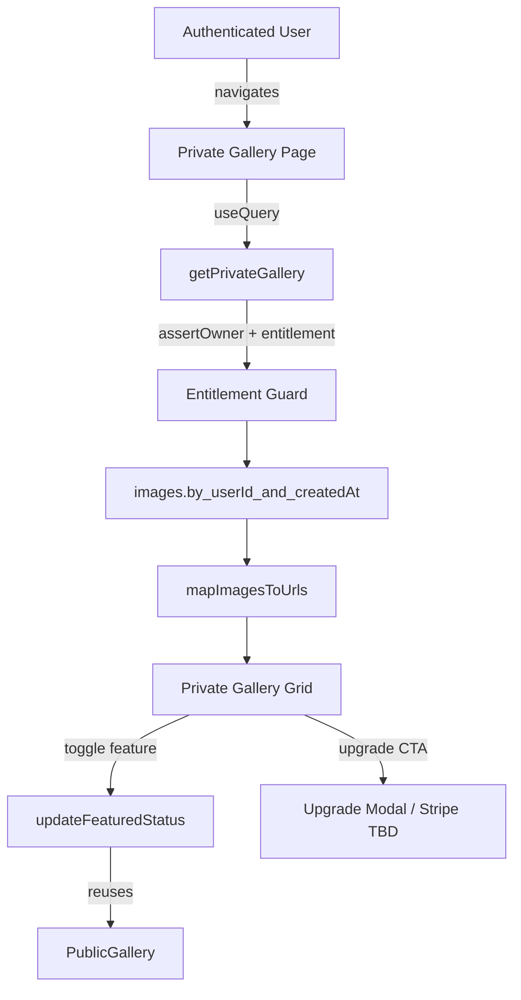

# Private Gallery Access Technical Specification

**Document Name:** Private Galleries for Premium Members Implementation Plan  
**Date:** February 18, 2025  
**Version:** 0.1  
**Status:** Planning

## Executive Summary
Create a premium-only private gallery experience so authenticated users can browse every image they generate without exposing other members' work. The feature will surface a personal, real-time gallery backed by Convex queries that enforce ownership checks. Premium members can keep their creations private by default while still promoting selected images to the existing [Public Gallery](../active/unauthenticated-gallery-spec.md). The plan adds Convex-hosted entitlement tracking, owner-scoped queries, and a dashboard view that reuses the public modal while hiding share controls unless the image is explicitly featured. Non-premium images automatically expire after three days so storage costs stay predictable.

## Problem Statement

### Current Experience
- After signing in, the gallery feed shows images from all users without separation.
- No private space exists for reviewing one's own originals or generated variants.
- Sharing/feature toggles are the only privacy control; users cannot audit their complete history.
- There is no upsell path that meaningfully differentiates free and premium accounts.

### Opportunity
- Provide a privacy-respecting default that builds trust and encourages more generation.
- Deliver tangible value for a future paid tier by making private galleries exclusive to premium members.
- Reuse the featured toggle to publish selected pieces into the PublicGallery, preserving social proof while honoring ownership.
- Lay the groundwork for billing by formalizing membership metadata inside Convex and Clerk.

## Goals
- Offer a paginated, owner-scoped gallery that lists every original and generated image for the signed-in user.
- Gate private gallery access behind a `premium` entitlement while showing a clear upgrade path to free users.
- Preserve existing public gallery behavior: only images explicitly marked featured appear to others.
- Maintain a shared real-time feed so free users can still review their most recent generations via the public gallery view.
- Ensure private gallery mutations (feature/unfeature, delete in future iterations) reuse centralized ownership checks.
- Provide analytics hooks to measure premium engagement (views, upgrade clicks, feature toggles).

## Non-Goals
- Implementing end-to-end payments or subscription billing (out of scope for this iteration).
- Building complex filters (search, tags, AI curation) inside the private gallery.
- Rewriting the public gallery feed that currently lets all users see the most recent generations.
- Migrating legacy admin tooling beyond ensuring admin disables are honored in the private view.

## Dependencies & Related Work
- Builds on the featured image system defined in [Unauthenticated Gallery Technical Specification](../active/unauthenticated-gallery-spec.md).
- Requires Clerk identity metadata for bootstrapping but Convex `userSettings` remains the canonical source of truth for membership checks.
- Relies on existing Convex helpers: `mapImagesToUrls`, `assertOwner`, pagination validators.

## Architecture Overview

### Data Flow


### Data Model & Storage Changes
- **Images table:**
  - Add index `by_userId_and_createdAt` to support owner-scoped chronological pagination without scanning other users' documents.
  - Confirm all uploads set `userId`; add background backfill for historical rows lacking `userId`.
  - Optional: add `lastViewedAt` (future iteration) for activity tracking—documented but deferred.
- **User settings table (new canonical source):** persists membership and feature flags. Convex is the only read path used for gating; Clerk merely hydrates updates.
  ```ts
  // convex/schema.ts
  userSettings: defineTable({
    userId: v.string(),
    membershipTier: v.union(v.literal("free"), v.literal("premium")),
    privateGalleryEnabled: v.boolean(),
    membershipExpiresAt: v.optional(v.number()),
    createdAt: v.number(),
    updatedAt: v.number(),
  }).index("by_userId", ["userId"]).index("by_membershipTier", ["membershipTier"]),
  ```
- **System tasks:** Add an internal action to synchronize Clerk metadata -> Convex `userSettings` on sign-in or webhook events, but all UI and query checks must read from Convex.

### Retention & Housekeeping
- **Free-tier expiry:** schedule a Convex cron job that deletes non-premium users' images after 72 hours. The job should:
  - Query `userSettings` for `membershipTier === "free"` and batch process their images via `images.by_userId_and_createdAt`.
  - Use a shared helper (see `convex/lib/images.ts`) to generate signed URLs before deletion when sending notifications (future iteration) to avoid duplicating logic.
  - Guard against deleting featured public images; skip any `isFeatured === true` records until product decides otherwise.
- **Legacy public gallery:** leave existing unauthenticated gallery untouched so historical, non-owned images remain discoverable. No migration is required beyond optional cleanup scripts if we decide to start fresh.

### Key Files & Ownership
- `convex/schema.ts`: add `userSettings` table, new membership indexes, and `images.by_userId_and_createdAt`.
- `convex/lib/entitlements.ts` (new): centralize `assertPremiumAccess` and shared helpers reused by queries/mutations.
- `convex/lib/retention.ts` (new): helper utilities for determining expiration thresholds and batching deletes, composed by cron/action code.
- `convex/images.ts`: register `getPrivateGallery`, `getUserGalleryMetadata`, and reuse existing helpers (`mapImagesToUrls`, `assertOwner`).
- `convex/internal/users.ts` (new or existing folder): host `syncUserSettings` action and owner backfill to keep privileged logic off the public API surface.
- `convex/crons.ts`: schedule free-tier cleanup job that imports retention helper.
- `components/PrivateGallery.tsx`: client gallery component that composes existing cell/modal primitives.
- `app/gallery/page.tsx`: server entry point wiring authentication, premium gating UI, and upgrade CTA.
- `components/PublicImageModal.tsx`: extend props to support private mode without duplicating modal implementation.

### Access Control & Entitlements
- `getPrivateGallery` query must call `requireIdentity`, verify a matching `userSettings` record, and enforce `privateGalleryEnabled === true`.
- Return `authorizationError` if a free user calls the query; the client will render the upgrade state instead of an empty grid.
- Admin overrides: allow admins (from existing `admins` table) to bypass premium gating for support/debug tooling.

### Frontend Surfaces
- New authenticated route `/app/gallery` (exact segment TBD) rendering `PrivateGallery` component.
- Reuse `PublicImageModal` in read-only mode, hiding share links unless the image is featured or sharing is enabled.
- Add upgrade CTA card for non-premium users with ability to open a modal / link to billing.
- Integrate with layout navigation (side nav or top nav) so private gallery is discoverable post-login.

## Implementation Phases

### Phase 0 – Discovery & Analytics Baseline
- Audit current Clerk metadata to confirm available hooks for entitlements and outline how updates flow into Convex without duplicating checks in the client.
- Document existing helpers (`convex/lib/auth.ts`, `convex/lib/images.ts`, `convex/lib/validators.ts`) to ensure new code composes them rather than inlining ownership or URL logic again.
- Define analytics events (`private_gallery_viewed`, `private_gallery_upgrade_clicked`, `private_gallery_featured_to_public`).
- Document migration strategy for populating `userSettings` on first login.

### Phase 1 – Convex Entitlement Source of Truth
- Extend `convex/schema.ts` with `userSettings` table, the `by_userId_and_createdAt` image index, and supporting membership indexes.
- Implement `convex/lib/entitlements.ts` helper exporting `assertPremiumAccess(ctx, userId)` that wraps `assertOwner`/`requireIdentity` patterns so queries stay DRY.
- Implement `internal.users.syncUserSettings` action that:
  - Reads Clerk metadata (subject, `publicMetadata.tier` default `free`).
  - Upserts `userSettings` row with membership tier and `privateGalleryEnabled` flag (`true` iff tier is `premium`).
  - Records timestamps for auditing.
  - Never returns entitlement booleans for client use; only Convex functions consume the helper.
- Create `actions/users/onAuthenticatedRequest` (called from middleware or first page load) to trigger sync lazily until webhooks exist.
- Write background script `internal.migrations.backfillImageOwners` to set `userId` on historical images missing ownership (reuse existing patterns from `updateFeaturedStatus`).

### Phase 2 – Private Gallery Query & Mutations
- Add `getPrivateGallery` Convex query in `convex/images.ts`:
  - `args: { paginationOpts }`, `returns: PaginatedGalleryValidator`.
  - Calls shared entitlement helper to enforce premium status using Convex `userSettings` only.
  - Queries `images` with `by_userId_and_createdAt` ordered by `createdAt` desc and reuses `mapImagesToUrls` to avoid duplicating signed URL logic.
  - Filters out admin-disabled images unless viewer is admin via the existing `assertOwner` flow.
- Introduce `getUserGalleryMetadata` query returning counts, membership tier, and upgrade hints for UI state.
- Update `updateFeaturedStatus` mutation (if needed) to emit analytics event when a private image becomes public.
- Optional future-proofing: stub `deleteImage` mutation behind admin flag (documented but not built in this phase).

### Phase 3 – Frontend Experience
- Create `components/PrivateGallery.tsx` client component mirroring `PublicGallery` but using owner-scoped query + optimistic pagination cache. Reuse existing gallery cell/card styles instead of duplicating Tailwind classes.
- Add new route (e.g., `app/gallery/page.tsx`) that:
  - Wraps `PrivateGallery` inside authenticated layout.
  - Handles three states: loading, premium access (render grid), free access (render upgrade CTA), and empty gallery message.
- Reuse `PublicImageModal` with prop `mode="private"` to hide CTA for unauthenticated viewers and show feature toggle when allowed.
- Wire navigation entry (button/link) visible once signed in, ideally in the same layout component that currently links to the public gallery to avoid duplicate navigation code.
- Add upgrade CTA that triggers existing or placeholder billing modal; record analytics events.
- Ensure `app/layout.tsx` or shared navigation component exposes a single source of truth for nav links to avoid duplicating menu entries between public/private galleries.

### Phase 4 – QA, Rollout & Documentation
- Manual QA across desktop/mobile for pagination, modal navigation, and upgrade gating.
- Verify admin-disabled images show a lock state yet remain visible to owners.
- Exercise the non-premium retention cron in a staging environment to confirm three-day deletions skip premium and featured images.
- Ensure `bun run lint` and `bun run build` pass with new components.
- Document operational runbooks: how to manually grant premium via Clerk metadata, how to backfill owners, troubleshooting tips, and how to pause the retention cron if necessary.
- Update progress tracker once phase milestones are hit.

## Testing & Verification
- **Automated:** `bun run lint`, `bun run build` for type safety; add unit coverage for entitlement utilities if introduced.
- **Manual:**
  - Premium user: confirm gallery lists originals + generated images, feature toggle works, and selected images appear in public gallery.
  - Free user: confirm upgrade CTA appears, queries do not leak data (network tab should return 401/403 style error).
  - Admin: confirm ability to inspect any user's gallery via admin tooling (if implemented) without triggering paywall.
  - Responsive QA: ensure grid + modal operate correctly on mobile breakpoints.
  - Regression: verify existing unauthenticated PublicGallery behavior remains unchanged.

## Security & Privacy Considerations
- Enforce strict owner checks in Convex queries/mutations; never accept userId from client.
- Treat premium gating as security boundary—return explicit errors (no silent fallbacks) and log unauthorized attempts for monitoring.
- Ensure URLs returned by `mapImagesToUrls` remain short-lived signed URLs; discourage caching private images client-side.
- Store minimal membership metadata (tier, expiry) to reduce PII footprint; avoid logging raw Clerk tokens.
- Add alerting for failures in `syncUserSettings` so entitlement drift is detected early and for the retention cron so unexpected deletions are caught quickly.
- When deleting free-tier images, double-check entitlement status inside the cron run (never trust cached data) to avoid race conditions if a user upgrades within the three-day window.

## Open Questions
- How do we expose retention messaging in the UI so free users understand the three-day limit without overwhelming them? (Needs product copy.)
- Should featured images created by free users bypass the three-day deletion or be re-generated from premium owners only? (Product decision.)
