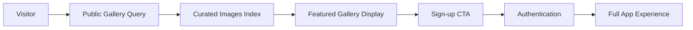

# Unauthenticated Gallery Technical Specification

**Document Name:** Public Gallery for Unauthenticated Users Implementation Plan  
**Date:** January 27, 2025  
**Version:** 1.0  
**Status:** Planned

## Executive Summary

Enable unauthenticated users to view a public gallery of featured image transformations to inspire sign-ups and demonstrate the application's capabilities. The gallery will showcase featured anime transformations while maintaining user privacy with simple opt-in controls.

## Problem Statement

### Current Experience

- Unauthenticated users see only a sign-in prompt with text description
- No visual proof of the application's transformation quality
- Users must "take a leap of faith" without seeing results
- No social proof or inspiration to drive conversions

### Opportunity

- Show inspiring transformations to demonstrate value immediately
- Create "wow factor" that drives sign-ups
- Leverage social proof of successful transformations
- Build trust through transparency of results

## Goals

- **Inspiration-driven conversion**: Users see amazing results before signing up
- **Social proof**: Showcase community-generated content
- **Privacy protection**: Only show explicitly featured images
- **Performance optimization**: Fast loading with pagination
- **Simplicity**: Easy featured/unfeatured toggle for users

## Non-Goals

- Showing all user images (privacy violation)
- Complex filtering/search for unauthenticated users
- User-specific galleries (requires auth)
- Real-time updates for anonymous users
- Quality scoring or automated curation systems

## User Stories

- As an unauthenticated visitor, I can see inspiring anime transformations to understand the app's value
- As an unauthenticated visitor, I can browse a gallery that makes me excited to try the tool
- As an authenticated user, I can mark my transformations as featured for public display
- As an authenticated user, I maintain full control over my image privacy
- As a system, I can track which user uploaded which images for proper attribution

## Architecture Overview

### Data Flow



### Technical Approach

- **Backend**: New public query with featured image filtering
- **Frontend**: Gallery component reuse with unauthenticated state
- **User Tracking**: Link images to users for proper ownership
- **Privacy**: Simple featured toggle for public display

## Detailed Design

### Phase 1: Simple Featured System

#### Database Schema Updates

**REUSE EXISTING**: The current schema in `convex/schema.ts` already has a robust `images` table. We only need to add the following fields to the existing structure:

```typescript
// convex/schema.ts - ADD to existing images table
export default defineSchema({
  images: defineTable({
    body: v.id("_storage"), // ✅ EXISTING - Storage ID for the image file
    createdAt: v.number(), // ✅ EXISTING - Creation timestamp
    isGenerated: v.optional(v.boolean()), // ✅ EXISTING - Whether this is a generated image
    originalImageId: v.optional(v.id("images")), // ✅ EXISTING - Reference to original image
    generationStatus: v.optional(...), // ✅ EXISTING - Processing status
    generationError: v.optional(v.string()), // ✅ EXISTING - Error messages
    generationAttempts: v.optional(v.number()), // ✅ EXISTING - Attempt counter
    sharingEnabled: v.optional(v.boolean()), // ✅ EXISTING - Sharing control
    shareExpiresAt: v.optional(v.number()), // ✅ EXISTING - Expiration timestamp

    // 🆕 NEW FIELDS TO ADD:
    userId: v.optional(v.string()), // Track Clerk user ID who uploaded the image
    isFeatured: v.optional(v.boolean()), // Simple toggle for public gallery
    featuredAt: v.optional(v.number()), // Timestamp when marked as featured
    isDisabledByAdmin: v.optional(v.boolean()), // Admin can disable inappropriate featured images
    disabledByAdminAt: v.optional(v.number()), // Timestamp when disabled by admin
    disabledByAdminReason: v.optional(v.string()), // Reason for admin disable
  })
    .index("by_is_generated", ["isGenerated"]) // ✅ EXISTING - Used by current gallery
    .index("by_generation_status", ["generationStatus"]) // ✅ EXISTING - Used for filtering
    .index("by_is_generated_and_status", ["isGenerated", "generationStatus"]) // ✅ EXISTING - Compound index
    .index("by_sharing_enabled", ["sharingEnabled"]) // ✅ EXISTING - Used for sharing
    // 🆕 NEW INDEXES TO ADD:
    .index("by_user", ["userId"]) // Find images by user
    .index("by_featured", ["isFeatured"]) // Find featured images
    .index("by_featured_date", ["isFeatured", "featuredAt"]), // Featured images by date
});
```

#### Featured Controls

**REUSE EXISTING**: We'll leverage the existing Clerk auth system that's already configured.

- **Simple toggle**: Users can mark/unmark images as featured
- **User ownership**: Track Clerk user ID (no new users table needed - use existing auth)
- **Admin oversight**: Admins can disable inappropriate featured images (check via Clerk user metadata)
- **Easy management**: Toggle featured status anytime (unless admin-disabled)

### Phase 2: Public Gallery Backend

#### Public Query Implementation

**REUSE EXISTING**: We can extend the existing `getGalleryImagesPaginated` query pattern and batch URL generation logic from `convex/images.ts`.

```typescript
// convex/images.ts - ADD new public query using existing patterns
export const getPublicGallery = query({
  args: {
    paginationOpts: paginationOptsValidator, // ✅ REUSE - Already imported
  },
  // ✅ REUSE - Same return type pattern as getGalleryImagesPaginated
  returns: v.object({
    page: v.array(
      v.object({
        _id: v.id("images"),
        _creationTime: v.number(),
        body: v.id("_storage"),
        createdAt: v.number(),
        url: v.string(),
        userId: v.optional(v.string()), // Clerk user ID
        isFeatured: v.optional(v.boolean()),
      })
    ),
    isDone: v.boolean(),
    continueCursor: v.union(v.string(), v.null()),
  }),
  handler: async (ctx, args) => {
    // ✅ REUSE - Follow existing index-based query pattern (avoid filters per Convex rules)
    const result = await ctx.db
      .query("images")
      .withIndex("by_featured", (q) => q.eq("isFeatured", true))
      .filter((q) => q.neq(q.field("isDisabledByAdmin"), true)) // Only exception - admin moderation filter
      .order("desc")
      .paginate(args.paginationOpts);

    // ✅ REUSE - Batch URL generation pattern from existing queries
    const storageIds = result.page.map((img) => img.body);
    const urls = await Promise.all(storageIds.map((id) => ctx.storage.getUrl(id)));

    // ✅ REUSE - Efficient URL mapping pattern
    const imagesWithUrls = result.page.map((image, index) => ({
      _id: image._id,
      _creationTime: image._creationTime,
      body: image.body,
      createdAt: image.createdAt,
      userId: image.userId,
      isFeatured: image.isFeatured,
      url: urls[index],
    }));

    // ✅ REUSE - URL filtering pattern
    return {
      page: imagesWithUrls.filter(
        (image): image is typeof image & { url: string } => image.url !== null
      ),
      isDone: result.isDone,
      continueCursor: result.continueCursor,
    };
  },
});
```

### Phase 3: Frontend Integration

**REUSE EXISTING**: We can heavily reuse the existing `ImagePreview` component and its patterns.

#### Unauthenticated Gallery Component

```typescript
// New component: components/PublicGallery.tsx
"use client";
import { useQuery } from "convex/react";
import { api } from "@/convex/_generated/api";
import { useState, useMemo } from "react";
import Image from "next/image";
import { Button } from "./ui/button";

// ✅ REUSE - Same type inference pattern as ImagePreview.tsx
type PublicImageFromQuery = NonNullable<ReturnType<typeof useQuery<typeof api.images.getPublicGallery>>>;

export default function PublicGallery() {
  const [paginationOpts, setPaginationOpts] = useState({
    numItems: 16, // ✅ REUSE - Same page size as existing gallery
    cursor: null,
  });

  const galleryResult = useQuery(api.images.getPublicGallery, { paginationOpts });

  // ✅ REUSE - Same memoization pattern from main page
  const images = useMemo(() => galleryResult?.page || [], [galleryResult?.page]);

  // ✅ REUSE - Same early return pattern
  if (images.length === 0 && galleryResult === undefined) {
    return (
      <div className="flex items-center justify-center py-12">
        <div className="w-6 h-6 border-2 border-current border-t-transparent rounded-full animate-spin"></div>
      </div>
    );
  }

  return (
    <div className="space-y-8">
      <div className="text-center space-y-4">
        <h2 className="text-2xl font-semibold">See the magic in action</h2>
        <p className="text-muted-foreground max-w-2xl mx-auto">
          Real transformations created by our community. Your photos could look this amazing too.
        </p>
      </div>

      {/* ✅ REUSE - Exact same grid layout as ImagePreview component */}
      <div className="grid grid-cols-1 sm:grid-cols-2 lg:grid-cols-3 xl:grid-cols-4 gap-4">
        {images.map((image) => (
          <div key={image._id} className="group">
            {/* ✅ REUSE - Same card styling as ImagePreview */}
            <div className="bg-card border border-border/30 hover:border-border transition-all duration-200 overflow-hidden rounded-xl shadow-sm hover:shadow-md">
              <div className="aspect-square relative">
                <Image
                  src={image.url}
                  alt="Anime transformation example"
                  fill
                  className="object-cover transition-all duration-300 group-hover:scale-[1.02]"
                  unoptimized={true} // ✅ REUSE - Same as existing component
                  sizes="(max-width: 640px) 100vw, (max-width: 768px) 50vw, (max-width: 1200px) 33vw, 25vw"
                  // ✅ REUSE - Same error handling pattern as ImagePreview
                  onError={(e) => {
                    const target = e.target as HTMLImageElement;
                    target.style.display = "none";
                    const parent = target.parentElement;
                    if (parent) {
                      parent.innerHTML = `
                        <div class="flex items-center justify-center h-full text-muted-foreground bg-muted/30">
                          <div class="text-center">
                            <svg class="w-8 h-8 mx-auto mb-2 opacity-50" fill="none" viewBox="0 0 24 24" stroke="currentColor">
                              <path stroke-linecap="round" stroke-linejoin="round" stroke-width="1.5" d="M4 16l4.586-4.586a2 2 0 012.828 0L16 16m-2-2l1.586-1.586a2 2 0 012.828 0L20 14m-6-6h.01M6 20h12a2 2 0 002-2V6a2 2 0 00-2-2H6a2 2 0 00-2 2v12a2 2 0 002 2z"/>
                            </svg>
                            <div class="text-xs opacity-50">Unable to load</div>
                          </div>
                        </div>
                      `;
                    }
                  }}
                />

                {/* Featured indicator */}
                <div className="absolute top-2 right-2 bg-gradient-to-r from-purple-500 to-blue-500 text-white text-xs px-2 py-1 rounded-full">
                  ✨ Featured
                </div>
              </div>
            </div>
          </div>
        ))}
      </div>

      {/* ✅ REUSE - Same load more pattern as ImagePreview */}
      {galleryResult?.continueCursor && !galleryResult.isDone && (
        <div className="flex items-center justify-center py-8">
          <Button
            onClick={() => setPaginationOpts(prev => ({
              numItems: 16,
              cursor: galleryResult.continueCursor,
            }))}
            variant="ghost"
            className="text-sm text-muted-foreground hover:text-foreground transition-colors"
          >
            Show more examples
          </Button>
        </div>
      )}
    </div>
  );
}
```

#### Integration with Landing Page

**REUSE EXISTING**: We'll integrate with the existing landing page structure in `app/page.tsx`.

```typescript
// app/page.tsx - UPDATE existing Unauthenticated section
<Unauthenticated>
  <div className="flex flex-col w-full min-h-screen">
    {/* ✅ REUSE - Keep existing header structure */}
    <header className="sticky top-0 z-40 flex items-center justify-between w-full px-6 py-4 border-b border-border/20 bg-background/95 backdrop-blur-sm">
      <div>
        <h1 className="text-2xl font-bold text-foreground">Anime Studio</h1>
        <p className="text-sm text-muted-foreground mt-0.5">
          Transform objects into anime illustrations
        </p>
      </div>
      <div className="text-sm text-muted-foreground">Sign in to start</div>
    </header>

    {/* ✅ MODIFY - Add gallery to existing main content */}
    <main className="flex-1 flex flex-col items-center justify-center gap-12 p-6 text-center">
      <div className="space-y-8 max-w-3xl">
        {/* ✅ REUSE - Keep existing hero elements */}
        <div className="w-20 h-20 mx-auto rounded-3xl bg-gradient-to-br from-purple-400 via-blue-500 to-indigo-600 flex items-center justify-center shadow-lg breathe">
          <Upload className="w-10 h-10 text-white" />
        </div>
        <div className="space-y-6">
          <h2 className="text-3xl md:text-5xl font-semibold tracking-tight">
            Bring your photos to life
          </h2>
          <p className="text-muted-foreground text-lg md:text-xl leading-relaxed max-w-2xl mx-auto">
            Transform objects in your photos into magical 2D anime illustrations. Sign in to
            upload images and watch as everyday items come to life with whimsical anime charm!
          </p>
        </div>
        
        {/* 🆕 ADD - Public gallery showcase */}
        <div className="w-full max-w-7xl">
          <PublicGallery />
        </div>

        {/* ✅ REUSE - Keep existing CTA */}
        <SignInButton>
          <Button className="btn-primary px-12 py-4 text-lg font-medium rounded-2xl shadow-lg hover:shadow-xl transition-all duration-200">
            Start Creating
          </Button>
        </SignInButton>
      </div>
    </main>
  </div>
</Unauthenticated>
```

### Phase 4: User Management Interface

#### Simple Featured Toggle

```typescript
// components/ImageModal.tsx - Add to sharing settings
<div className="space-y-4">
  <div className="flex items-center justify-between">
    <div className="space-y-1">
      <label className="text-sm font-medium">Feature in Public Gallery</label>
      <p className="text-xs text-muted-foreground">
        Showcase your transformation to inspire others
      </p>
    </div>
    <Switch
      checked={isFeatured}
      onCheckedChange={handleFeaturedToggle}
    />
  </div>
</div>
```

#### Admin Moderation Functions

**REUSE EXISTING**: We'll create a new `convex/admin.ts` file that reuses existing patterns and leverages Clerk's user metadata for admin checks.

```typescript
// convex/admin.ts - NEW file for admin moderation functions
import { paginationOptsValidator } from "convex/server";
import { v } from "convex/values";
import { mutation, query } from "./_generated/server";

// ✅ REUSE - DRY admin check helper (follows Convex rules)
async function checkAdminAuth(ctx: any) {
  const identity = await ctx.auth.getUserIdentity();
  if (!identity) throw new Error("Not authenticated");
  
  // ✅ REUSE - Use Clerk user metadata instead of separate users table
  // Admin status can be set via Clerk Dashboard or API
  const isAdmin = identity.publicMetadata?.isAdmin === true;
  if (!isAdmin) throw new Error("Not authorized - admin only");
  
  return identity;
}

export const disableFeaturedImage = mutation({
  args: {
    imageId: v.id("images"),
    reason: v.string(),
  },
  returns: v.null(),
  handler: async (ctx, args) => {
    await checkAdminAuth(ctx); // ✅ REUSE - DRY auth check
    
    // ✅ REUSE - Same patch pattern as existing updateShareSettings
    await ctx.db.patch(args.imageId, {
      isDisabledByAdmin: true,
      disabledByAdminAt: Date.now(),
      disabledByAdminReason: args.reason,
    });
    return null;
  },
});

export const enableFeaturedImage = mutation({
  args: {
    imageId: v.id("images"),
  },
  returns: v.null(),
  handler: async (ctx, args) => {
    await checkAdminAuth(ctx); // ✅ REUSE - DRY auth check
    
    // ✅ REUSE - Same patch pattern as existing mutations
    await ctx.db.patch(args.imageId, {
      isDisabledByAdmin: false,
      disabledByAdminAt: undefined,
      disabledByAdminReason: undefined,
    });
    return null;
  },
});

export const getAdminFeaturedImages = query({
  args: {
    paginationOpts: paginationOptsValidator, // ✅ REUSE - Same as other paginated queries
  },
  // ✅ REUSE - Same return type pattern as getPublicGallery
  returns: v.object({
    page: v.array(
      v.object({
        _id: v.id("images"),
        _creationTime: v.number(),
        body: v.id("_storage"),
        createdAt: v.number(),
        url: v.string(),
        userId: v.optional(v.string()), // Clerk user ID
        isFeatured: v.optional(v.boolean()),
        isDisabledByAdmin: v.optional(v.boolean()),
        disabledByAdminReason: v.optional(v.string()),
      })
    ),
    isDone: v.boolean(),
    continueCursor: v.union(v.string(), v.null()),
  }),
  handler: async (ctx, args) => {
    await checkAdminAuth(ctx); // ✅ REUSE - DRY auth check
    
    // ✅ REUSE - Same query pattern as getPublicGallery
    const result = await ctx.db
      .query("images")
      .withIndex("by_featured", (q) => q.eq("isFeatured", true))
      .order("desc")
      .paginate(args.paginationOpts);

    // ✅ REUSE - Same batch URL generation pattern
    const storageIds = result.page.map((img) => img.body);
    const urls = await Promise.all(storageIds.map((id) => ctx.storage.getUrl(id)));

    // ✅ REUSE - Same URL mapping pattern
    const imagesWithUrls = result.page.map((image, index) => ({
      _id: image._id,
      _creationTime: image._creationTime,
      body: image.body,
      createdAt: image.createdAt,
      userId: image.userId,
      isFeatured: image.isFeatured,
      isDisabledByAdmin: image.isDisabledByAdmin,
      disabledByAdminReason: image.disabledByAdminReason,
      url: urls[index],
    }));

    // ✅ REUSE - Same URL filtering pattern
    return {
      page: imagesWithUrls.filter(
        (image): image is typeof image & { url: string } => image.url !== null
      ),
      isDone: result.isDone,
      continueCursor: result.continueCursor,
    };
  },
});
```

#### User Tracking Integration

**REUSE EXISTING**: We'll modify the existing `uploadAndScheduleGeneration` mutation in `convex/images.ts`.

```typescript
// convex/images.ts - MODIFY existing mutation to add user tracking
export const uploadAndScheduleGeneration = mutation({
  args: {
    storageId: v.id("_storage"),
  },
  returns: v.id("images"),
  handler: async (ctx, args) => {
    const { storageId } = args;

    // ✅ REUSE - Keep existing validation logic
    const meta = await ctx.db.system.get(storageId);
    if (!meta) throw new Error("VALIDATION: Missing storage metadata");
    // ... existing validation ...

    // 🆕 ADD - Track user via existing Clerk auth
    const identity = await ctx.auth.getUserIdentity();
    const userId = identity?.subject; // Clerk user ID

    // ✅ MODIFY - Add user tracking to existing image creation
    const originalImageId = await ctx.db.insert("images", {
      body: storageId,
      createdAt: Date.now(),
      isGenerated: false,
      generationStatus: "pending" as const,
      generationAttempts: 0,
      // 🆕 ADD - New tracking fields
      userId, // Track Clerk user ID
      isFeatured: false, // Default to not featured
    });

    // ✅ REUSE - Keep existing scheduling logic
    await ctx.scheduler.runAfter(0, internal.generate.generateImage, {
      storageId,
      originalImageId,
      contentType,
    });

    return originalImageId;
  },
});
```

### Phase 5: Admin Interface

#### Admin Moderation Dashboard

```typescript
// components/AdminModerationDashboard.tsx
"use client";
import { useQuery, useMutation } from "convex/react";
import { api } from "@/convex/_generated/api";
import { Id } from "@/convex/_generated/dataModel";
import { useState } from "react";

export default function AdminModerationDashboard() {
  const [paginationOpts, setPaginationOpts] = useState({
    numItems: 20,
    cursor: null,
  });

  const featuredImages = useQuery(api.admin.getAdminFeaturedImages, { paginationOpts });
  const disableImage = useMutation(api.admin.disableFeaturedImage);
  const enableImage = useMutation(api.admin.enableFeaturedImage);
  const [disableReason, setDisableReason] = useState("");
  const [selectedImageId, setSelectedImageId] = useState<Id<"images"> | null>(null);

  const handleDisableImage = async (imageId: Id<"images">, reason: string) => {
    try {
      await disableImage({ imageId, reason });
      setSelectedImageId(null);
      setDisableReason("");
    } catch (error) {
      console.error("Failed to disable image:", error);
    }
  };

  const handleEnableImage = async (imageId: Id<"images">) => {
    try {
      await enableImage({ imageId });
    } catch (error) {
      console.error("Failed to enable image:", error);
    }
  };

  return (
    <div className="space-y-8">
      <div className="text-center space-y-4">
        <h2 className="text-2xl font-semibold">Featured Images Moderation</h2>
        <p className="text-muted-foreground">
          Review and moderate featured images in the public gallery
        </p>
      </div>

      <div className="grid grid-cols-1 sm:grid-cols-2 lg:grid-cols-3 xl:grid-cols-4 gap-4">
        {featuredImages?.page.map((image) => (
          <div key={image._id} className="group">
            <div className={`bg-card border transition-all duration-200 overflow-hidden rounded-xl shadow-sm ${
              image.isDisabledByAdmin 
                ? "border-red-500 bg-red-50 dark:bg-red-900/20" 
                : "border-border/30 hover:border-border hover:shadow-md"
            }`}>
              <div className="aspect-square relative">
                <Image
                  src={image.url}
                  alt="Featured transformation"
                  fill
                  className="object-cover"
                  sizes="(max-width: 640px) 100vw, (max-width: 768px) 50vw, (max-width: 1200px) 33vw, 25vw"
                />

                {/* Status indicator */}
                <div className="absolute top-2 left-2">
                  {image.isDisabledByAdmin ? (
                    <div className="bg-red-500 text-white text-xs px-2 py-1 rounded-full">
                      Disabled
                    </div>
                  ) : (
                    <div className="bg-green-500 text-white text-xs px-2 py-1 rounded-full">
                      Live
                    </div>
                  )}
                </div>
              </div>

              <div className="p-4 space-y-3">
                <div className="text-xs text-muted-foreground">
                  User: {image.userId || "Unknown"}
                </div>
                
                {image.isDisabledByAdmin && image.disabledByAdminReason && (
                  <div className="text-xs text-red-600 bg-red-50 dark:bg-red-900/20 p-2 rounded">
                    <strong>Disabled:</strong> {image.disabledByAdminReason}
                  </div>
                )}

                <div className="flex gap-2">
                  {image.isDisabledByAdmin ? (
                    <Button
                      onClick={() => handleEnableImage(image._id)}
                      variant="outline"
                      size="sm"
                      className="text-green-600 border-green-600 hover:bg-green-50"
                    >
                      Re-enable
                    </Button>
                  ) : (
                    <Button
                      onClick={() => setSelectedImageId(image._id)}
                      variant="outline"
                      size="sm"
                      className="text-red-600 border-red-600 hover:bg-red-50"
                    >
                      Disable
                    </Button>
                  )}
                </div>
              </div>
            </div>
          </div>
        ))}
      </div>

      {/* Disable Image Modal */}
      {selectedImageId && (
        <div className="fixed inset-0 bg-black/50 flex items-center justify-center p-4 z-50">
          <div className="bg-white dark:bg-gray-800 rounded-lg p-6 max-w-md w-full space-y-4">
            <h3 className="text-lg font-semibold">Disable Featured Image</h3>
            <p className="text-sm text-muted-foreground">
              This will remove the image from the public gallery. Please provide a reason:
            </p>
            <textarea
              value={disableReason}
              onChange={(e) => setDisableReason(e.target.value)}
              placeholder="Reason for disabling (e.g., inappropriate content, quality issues)"
              className="w-full p-3 border rounded-md"
              rows={3}
            />
            <div className="flex gap-2 justify-end">
              <Button
                onClick={() => {
                  setSelectedImageId(null);
                  setDisableReason("");
                }}
                variant="ghost"
              >
                Cancel
              </Button>
              <Button
                onClick={() => selectedImageId && handleDisableImage(selectedImageId, disableReason)}
                disabled={!disableReason.trim()}
                variant="destructive"
              >
                Disable Image
              </Button>
            </div>
          </div>
        </div>
      )}

      {/* Load More */}
      {featuredImages?.continueCursor && (
        <div className="flex justify-center">
          <Button
            onClick={() => setPaginationOpts(prev => ({
              numItems: 20,
              cursor: featuredImages.continueCursor,
            }))}
            variant="ghost"
          >
            Load More Images
          </Button>
        </div>
      )}
    </div>
  );
}
```

#### Updated Featured Toggle (User Interface)

**REUSE EXISTING**: We'll add the featured toggle to the existing `ImageModal` component, following the same patterns as the sharing settings.

```typescript
// components/ImageModal.tsx - ADD to existing settings section
// Add this to the existing showSettings section, after sharing controls

{/* 🆕 ADD - Featured toggle (reuse same pattern as sharing toggle) */}
<div className="space-y-4">
  <div className="flex items-center justify-between">
    <div className="space-y-1">
      <label className="text-sm font-medium">Feature in Public Gallery</label>
      <p className="text-xs text-muted-foreground">
        {image.isDisabledByAdmin 
          ? "This image was disabled by an admin and cannot be featured"
          : "Showcase your transformation to inspire others"
        }
      </p>
    </div>
    <Switch
      checked={image.isFeatured && !image.isDisabledByAdmin}
      onCheckedChange={handleFeaturedToggle} // ✅ REUSE - Same pattern as handleSharingToggle
      disabled={image.isDisabledByAdmin}
    />
  </div>
  
  {image.isDisabledByAdmin && image.disabledByAdminReason && (
    <div className="text-xs text-red-600 bg-red-50 dark:bg-red-900/20 p-2 rounded">
      <strong>Admin Note:</strong> {image.disabledByAdminReason}
    </div>
  )}
</div>

// 🆕 ADD - New mutation and handler (reuse same pattern as sharing functions)
const updateFeaturedStatus = useMutation(api.images.updateFeaturedStatus); // New mutation to create

const handleFeaturedToggle = async (enabled: boolean) => {
  try {
    await updateFeaturedStatus({
      imageId: image._id as Id<"images">,
      isFeatured: enabled,
    });
    toast.success(enabled ? "Added to public gallery" : "Removed from public gallery");
  } catch {
    toast.error("Failed to update featured status");
  }
};
```

**REUSE EXISTING**: We need to add one new mutation to `convex/images.ts` following the same pattern as `updateShareSettings`:

```typescript
// convex/images.ts - ADD new mutation following existing patterns
export const updateFeaturedStatus = mutation({
  args: {
    imageId: v.id("images"),
    isFeatured: v.boolean(),
  },
  returns: v.null(),
  handler: async (ctx, args) => {
    // ✅ REUSE - Same auth and ownership check as updateShareSettings
    const identity = await ctx.auth.getUserIdentity();
    if (!identity) throw new Error("Not authenticated");

    const image = await ctx.db.get(args.imageId);
    if (!image) throw new Error("Image not found");
    
    // Only allow the owner to toggle featured status (unless admin override)
    if (image.userId !== identity.subject) {
      throw new Error("Not authorized to modify this image");
    }

    // ✅ REUSE - Same patch pattern as existing mutations
    await ctx.db.patch(args.imageId, {
      isFeatured: args.isFeatured,
      featuredAt: args.isFeatured ? Date.now() : undefined,
    });
    return null;
  },
});
```

## Implementation Strategy

### Rollout Plan

1. **Phase 1**: Simple featured system and user tracking
2. **Phase 2**: Public query implementation for featured images
3. **Phase 3**: Frontend integration with existing components
4. **Phase 4**: User management interface for featured toggle
5. **Phase 5**: Admin moderation system and dashboard

### Simple Featured Approach

- **User control**: Users decide which images to feature
- **Easy toggle**: Mark/unmark as featured anytime in image modal
- **User tracking**: Know which user owns each image
- **Admin oversight**: Admins can disable inappropriate featured content

### Performance Considerations

- **Cached queries**: Public gallery can use longer cache times
- **CDN optimization**: Pre-generate thumbnails for featured images
- **Index efficiency**: Simple indexes on featured flag
- **Rate limiting**: Prevent abuse of public endpoints

## Security Considerations

### Privacy Protection

- **Featured only**: Default to private, only show explicitly featured images
- **User control**: Users can unfeature images anytime (unless admin-disabled)
- **User ownership**: Track which user uploaded each image
- **Admin moderation**: Admins can disable inappropriate featured content

### Content Safety

- **User responsibility**: Users choose what to feature
- **Admin oversight**: Admins can disable inappropriate featured content
- **Easy removal**: Users can unfeature content anytime (unless admin-disabled)
- **User accountability**: Link images to user accounts with admin visibility

## Testing & Verification

### User Experience Testing

- [ ] Unauthenticated users see inspiring gallery
- [ ] Gallery loads quickly with proper pagination
- [ ] Sign-up CTA appears prominently after gallery
- [ ] Mobile experience is optimized for browsing
- [ ] Images click to open in lightweight modal (no sharing controls)

### Privacy Testing

- [ ] Only featured images appear in public gallery
- [ ] Users can unfeature images anytime (unless admin-disabled)
- [ ] Unauthenticated users cannot see non-featured images
- [ ] User ownership is properly tracked for all images
- [ ] Admin-disabled images do not appear in public gallery
- [ ] Admin moderation functions work correctly

### Performance Testing

- [ ] Gallery loads under 500ms on 3G network
- [ ] Pagination works smoothly for 16-image increments
- [ ] No backend query performance degradation
- [ ] CDN-optimized image delivery

## Success Metrics

### Conversion Goals

- **Target**: 40% increase in sign-up conversion rate
- **Engagement**: 60%+ of visitors browse full gallery
- **Time on site**: 2x increase in session duration
- **Viral growth**: 25% of users share public gallery

### Technical Goals

- **Performance**: <500ms gallery load time
- **Simplicity**: Easy featured/unfeatured toggle
- **Privacy**: Zero accidental private image exposure
- **Uptime**: 99.9% availability for public endpoints

## Future Enhancements

### Phase 2 Additions (Post-Launch)

- **Search functionality**: Filter by transformation type
- **Categories**: Food, objects, people, pets, etc.
- **Trending section**: Most popular transformations
- **User attribution**: Optional credit to creators (with permission)

### Advanced Features

- **Social sharing**: Direct share buttons on public images
- **Embed widgets**: For external websites
- **Analytics dashboard**: Public gallery performance metrics
- **A/B testing**: Different gallery layouts and CTAs

## Risk Assessment

### Low Risk

- Reusing existing gallery components and patterns
- Leveraging established Convex query patterns
- Building on optimized image loading infrastructure

### Medium Risk

- User privacy expectations around public display
- Content moderation scalability as volume grows
- Performance impact of additional public queries

### High Risk

- Accidentally exposing private images (requires careful testing)
- Content liability and moderation requirements
- Potential abuse or inappropriate content

## Acceptance Criteria

### Core Functionality

- [ ] Unauthenticated users can browse high-quality transformations
- [ ] Only explicitly featured images appear in public gallery
- [ ] Gallery loading is fast and smooth across devices
- [ ] Clear sign-up CTA drives conversion after inspiration
- [ ] Users can control their featured image settings
- [ ] All images are properly linked to their uploading users

### Privacy & Security

- [ ] Zero private images exposed to unauthenticated users
- [ ] Users can unfeature images at any time (unless admin-disabled)
- [ ] Only user-selected featured images appear in gallery (unless admin-disabled)
- [ ] User ownership tracking works correctly
- [ ] Admin can disable inappropriate featured images
- [ ] Admin-disabled images are hidden from public gallery

### Performance & Scale

- [ ] Gallery loads in under 500ms on mobile networks
- [ ] Backend queries follow all Convex best practices
- [ ] Image delivery optimized for public consumption
- [ ] Pagination supports thousands of public images

## Development Commands

```bash
# Backend development
bunx convex dev                 # Watch schema and query changes

# Frontend development
bun run dev                    # Test gallery integration

# Component installation (if needed)
bunx shadcn@latest add badge   # For quality indicators
bunx shadcn@latest add card    # For gallery layout

# Testing
bun run build                  # TypeScript verification
bunx convex logs               # Monitor query performance
```

## Conclusion

The unauthenticated gallery represents a strategic opportunity to dramatically improve conversion rates by showcasing the application's transformation quality upfront. The implementation leverages existing components and infrastructure while adding simple user controls and ownership tracking.

**Expected Impact**: Transform the landing page from a "leap of faith" sign-up to an inspiring showcase that drives organic engagement and viral sharing.
