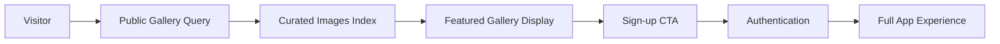

# Unauthenticated Gallery Technical Specification

**Document Name:** Public Gallery for Unauthenticated Users Implementation Plan  
**Date:** January 27, 2025  
**Version:** 1.0  
**Status:** Planned

## Executive Summary

Enable unauthenticated users to view a curated gallery of successful image transformations to inspire sign-ups and demonstrate the application's capabilities. The gallery will showcase the best anime transformations while maintaining user privacy and implementing smart curation algorithms.

## Problem Statement

### Current Experience

- Unauthenticated users see only a sign-in prompt with text description
- No visual proof of the application's transformation quality
- Users must "take a leap of faith" without seeing results
- No social proof or inspiration to drive conversions

### Opportunity

- Show inspiring transformations to demonstrate value immediately
- Create "wow factor" that drives sign-ups
- Leverage social proof of successful transformations
- Build trust through transparency of results

## Goals

- **Inspiration-driven conversion**: Users see amazing results before signing up
- **Social proof**: Showcase community-generated content
- **Privacy protection**: Only show explicitly public/consented images
- **Performance optimization**: Fast loading with pagination
- **Viral potential**: Shareable gallery that drives organic growth

## Non-Goals

- Showing all user images (privacy violation)
- Complex filtering/search for unauthenticated users
- User-specific galleries (requires auth)
- Real-time updates for anonymous users

## User Stories

- As an unauthenticated visitor, I can see inspiring anime transformations to understand the app's value
- As an unauthenticated visitor, I can browse a gallery that makes me excited to try the tool
- As an authenticated user, I can opt-in to having my best transformations featured publicly
- As an authenticated user, I maintain full control over my image privacy

## Architecture Overview

### Data Flow



### Technical Approach

- **Backend**: New public query with privacy filtering
- **Frontend**: Gallery component reuse with unauthenticated state
- **Curation**: Algorithm-based selection of best transformations
- **Privacy**: Explicit opt-in system for public display

## Detailed Design

### Phase 1: Privacy Infrastructure

#### Database Schema Updates

```typescript
// convex/schema.ts - Add to images table
export default defineSchema({
  images: defineTable({
    // ... existing fields

    // New privacy fields
    allowPublicDisplay: v.optional(v.boolean()), // Opt-in for public gallery
    qualityScore: v.optional(v.number()), // 1-10 curation scoring
    publicDisplayApprovedAt: v.optional(v.number()), // Timestamp of approval

    // Moderation fields
    moderationStatus: v.optional(
      v.union(
        v.literal("pending"), // Awaiting review
        v.literal("approved"), // Safe for public display
        v.literal("rejected"), // Not suitable for public
        v.literal("reported") // User-reported content
      )
    ),
  })
    .index("by_public_display", ["allowPublicDisplay"])
    .index("by_moderation_status", ["moderationStatus"])
    .index("by_quality_score", ["qualityScore"])
    .index("by_public_approved", ["allowPublicDisplay", "moderationStatus"]),
});
```

#### Privacy Controls

- **Opt-in system**: Users must explicitly allow public display
- **Automatic approval**: For users in good standing
- **Quality filtering**: Algorithm scores transformations 1-10
- **Moderation queue**: Review system for edge cases

### Phase 2: Public Gallery Backend

#### Public Query Implementation

```typescript
// convex/images.ts - New public query
export const getPublicGallery = query({
  args: {
    paginationOpts: paginationOptsValidator,
  },
  returns: v.object({
    page: v.array(
      v.object({
        _id: v.id("images"),
        _creationTime: v.number(),
        body: v.id("_storage"),
        createdAt: v.number(),
        url: v.string(),
        qualityScore: v.optional(v.number()),
      })
    ),
    isDone: v.boolean(),
    continueCursor: v.union(v.string(), v.null()),
  }),
  handler: async (ctx, args) => {
    // Query for high-quality, approved public images
    const result = await ctx.db
      .query("images")
      .withIndex("by_public_approved", (q) =>
        q.eq("allowPublicDisplay", true).eq("moderationStatus", "approved")
      )
      .order("desc")
      .paginate(args.paginationOpts);

    // Filter for high quality only (score >= 7)
    const highQualityImages = result.page.filter((img) => (img.qualityScore ?? 0) >= 7);

    // Batch URL generation
    const storageIds = highQualityImages.map((img) => img.body);
    const urls = await Promise.all(storageIds.map((id) => ctx.storage.getUrl(id)));

    // Map URLs efficiently
    const imagesWithUrls = highQualityImages.map((image, index) => ({
      _id: image._id,
      _creationTime: image._creationTime,
      body: image.body,
      createdAt: image.createdAt,
      qualityScore: image.qualityScore,
      url: urls[index],
    }));

    return {
      page: imagesWithUrls.filter((img) => img.url !== null),
      isDone: result.isDone,
      continueCursor: result.continueCursor,
    };
  },
});
```

### Phase 3: Frontend Integration

#### Unauthenticated Gallery Component

```typescript
// New component: components/PublicGallery.tsx
"use client";
import { useQuery } from "convex/react";
import { api } from "@/convex/_generated/api";
import Image from "next/image";

export default function PublicGallery() {
  const [paginationOpts, setPaginationOpts] = useState({
    numItems: 16,
    cursor: null,
  });

  const galleryResult = useQuery(api.images.getPublicGallery, { paginationOpts });

  return (
    <div className="space-y-8">
      <div className="text-center space-y-4">
        <h2 className="text-2xl font-semibold">See the magic in action</h2>
        <p className="text-muted-foreground max-w-2xl mx-auto">
          Real transformations created by our community. Your photos could look this amazing too.
        </p>
      </div>

      {/* Reuse existing ImagePreview component patterns */}
      <div className="grid grid-cols-1 sm:grid-cols-2 lg:grid-cols-3 xl:grid-cols-4 gap-4">
        {galleryResult?.page.map((image) => (
          <div key={image._id} className="group cursor-pointer">
            <div className="bg-card border border-border/30 hover:border-border transition-all duration-200 overflow-hidden rounded-xl shadow-sm hover:shadow-md">
              <div className="aspect-square relative">
                <Image
                  src={image.url}
                  alt="Anime transformation example"
                  fill
                  className="object-cover transition-all duration-300 group-hover:scale-[1.02]"
                  sizes="(max-width: 640px) 100vw, (max-width: 768px) 50vw, (max-width: 1200px) 33vw, 25vw"
                />

                {/* Quality indicator */}
                {image.qualityScore && image.qualityScore >= 9 && (
                  <div className="absolute top-2 right-2 bg-gradient-to-r from-purple-500 to-blue-500 text-white text-xs px-2 py-1 rounded-full">
                    ✨ Featured
                  </div>
                )}
              </div>
            </div>
          </div>
        ))}
      </div>

      {/* Load More */}
      {galleryResult?.continueCursor && (
        <div className="flex justify-center">
          <Button
            onClick={() => setPaginationOpts(prev => ({
              numItems: 16,
              cursor: galleryResult.continueCursor,
            }))}
            variant="ghost"
            className="text-muted-foreground hover:text-foreground"
          >
            Show more examples
          </Button>
        </div>
      )}
    </div>
  );
}
```

#### Integration with Landing Page

```typescript
// app/page.tsx - Unauthenticated section update
<Unauthenticated>
  <div className="flex flex-col w-full min-h-screen">
    {/* Header */}
    <header>...</header>

    {/* Hero section with gallery preview */}
    <main className="flex-1">
      <div className="flex flex-col items-center gap-12 p-6 text-center">
        {/* Existing hero content */}

        {/* Public gallery showcase */}
        <div className="w-full max-w-7xl">
          <PublicGallery />
        </div>

        {/* CTA after inspiration */}
        <div className="space-y-6">
          <h3 className="text-xl font-semibold">Ready to transform your photos?</h3>
          <SignInButton>
            <Button className="btn-primary px-12 py-4 text-lg">
              Start Creating For Free
            </Button>
          </SignInButton>
        </div>
      </div>
    </main>
  </div>
</Unauthenticated>
```

### Phase 4: Curation System

#### Quality Scoring Algorithm

```typescript
// convex/curation.ts - New internal action
export const scoreImageQuality = internalAction({
  args: {
    imageId: v.id("images"),
    originalStorageId: v.id("_storage"),
    generatedStorageId: v.id("_storage"),
  },
  returns: v.number(),
  handler: async (ctx, args) => {
    // Scoring factors (1-10 scale):
    let score = 5; // Base score

    // 1. Transformation clarity (does it look anime-like?)
    // 2. Object recognition (are objects clearly transformed?)
    // 3. Visual appeal (artistic quality)
    // 4. Completeness (no cut-off or errors)

    // Future: Could integrate with image analysis AI
    // For now: Manual scoring or simple heuristics

    return Math.min(10, Math.max(1, score));
  },
});
```

#### User Opt-in Interface

```typescript
// components/ImageModal.tsx - Add to sharing settings
<div className="space-y-4">
  <div className="flex items-center justify-between">
    <div className="space-y-1">
      <label className="text-sm font-medium">Feature in Public Gallery</label>
      <p className="text-xs text-muted-foreground">
        Help inspire others by showcasing your transformation
      </p>
    </div>
    <Switch
      checked={allowPublicDisplay}
      onCheckedChange={handlePublicDisplayToggle}
    />
  </div>
</div>
```

## Implementation Strategy

### Rollout Plan

1. **Phase 1**: Privacy infrastructure and opt-in system
2. **Phase 2**: Public query implementation with manual curation
3. **Phase 3**: Frontend integration with existing components
4. **Phase 4**: Automated quality scoring and moderation

### Privacy-First Approach

- **Explicit consent**: Users must opt-in to public display
- **Easy revocation**: Toggle off anytime in image modal
- **Quality threshold**: Only high-scoring images considered
- **Moderation review**: Human review for edge cases

### Performance Considerations

- **Cached queries**: Public gallery can use longer cache times
- **CDN optimization**: Pre-generate thumbnails for public images
- **Index efficiency**: Compound indexes for fast filtering
- **Rate limiting**: Prevent abuse of public endpoints

## Security Considerations

### Privacy Protection

- **Opt-in only**: Default to private, require explicit permission
- **Revocable consent**: Users can remove images anytime
- **No personal data**: Gallery shows only transformed images
- **Moderation queue**: Review system for inappropriate content

### Content Safety

- **Quality filtering**: Only high-scoring transformations
- **Abuse prevention**: Rate limiting and reporting system
- **Content policies**: Clear guidelines for public display
- **Takedown process**: Quick removal for problematic content

## Testing & Verification

### User Experience Testing

- [ ] Unauthenticated users see inspiring gallery
- [ ] Gallery loads quickly with proper pagination
- [ ] Sign-up CTA appears prominently after gallery
- [ ] Mobile experience is optimized for browsing
- [ ] Images click to open in lightweight modal (no sharing controls)

### Privacy Testing

- [ ] Only opted-in images appear in public gallery
- [ ] Users can revoke public display permission
- [ ] Unauthenticated users cannot see private images
- [ ] Quality threshold properly filters low-score images

### Performance Testing

- [ ] Gallery loads under 500ms on 3G network
- [ ] Pagination works smoothly for 16-image increments
- [ ] No backend query performance degradation
- [ ] CDN-optimized image delivery

## Success Metrics

### Conversion Goals

- **Target**: 40% increase in sign-up conversion rate
- **Engagement**: 60%+ of visitors browse full gallery
- **Time on site**: 2x increase in session duration
- **Viral growth**: 25% of users share public gallery

### Technical Goals

- **Performance**: <500ms gallery load time
- **Quality**: 95%+ approval rate for auto-curated images
- **Privacy**: Zero accidental private image exposure
- **Uptime**: 99.9% availability for public endpoints

## Future Enhancements

### Phase 2 Additions (Post-Launch)

- **Search functionality**: Filter by transformation type
- **Categories**: Food, objects, people, pets, etc.
- **Trending section**: Most popular transformations
- **User attribution**: Optional credit to creators (with permission)

### Advanced Features

- **Social sharing**: Direct share buttons on public images
- **Embed widgets**: For external websites
- **Analytics dashboard**: Public gallery performance metrics
- **A/B testing**: Different gallery layouts and CTAs

## Risk Assessment

### Low Risk

- Reusing existing gallery components and patterns
- Leveraging established Convex query patterns
- Building on optimized image loading infrastructure

### Medium Risk

- User privacy expectations around public display
- Content moderation scalability as volume grows
- Performance impact of additional public queries

### High Risk

- Accidentally exposing private images (requires careful testing)
- Content liability and moderation requirements
- Potential abuse or inappropriate content

## Acceptance Criteria

### Core Functionality

- [ ] Unauthenticated users can browse high-quality transformations
- [ ] Only explicitly consented images appear in public gallery
- [ ] Gallery loading is fast and smooth across devices
- [ ] Clear sign-up CTA drives conversion after inspiration
- [ ] Users can control their image public display settings

### Privacy & Security

- [ ] Zero private images exposed to unauthenticated users
- [ ] Users can opt-out of public display at any time
- [ ] Quality threshold prevents low-quality images from appearing
- [ ] Content moderation system handles edge cases

### Performance & Scale

- [ ] Gallery loads in under 500ms on mobile networks
- [ ] Backend queries follow all Convex best practices
- [ ] Image delivery optimized for public consumption
- [ ] Pagination supports thousands of public images

## Development Commands

```bash
# Backend development
bunx convex dev                 # Watch schema and query changes

# Frontend development
bun run dev                    # Test gallery integration

# Component installation (if needed)
bunx shadcn@latest add badge   # For quality indicators
bunx shadcn@latest add card    # For gallery layout

# Testing
bun run build                  # TypeScript verification
bunx convex logs               # Monitor query performance
```

## Conclusion

The unauthenticated gallery represents a strategic opportunity to dramatically improve conversion rates by showcasing the application's transformation quality upfront. The implementation leverages existing components and infrastructure while adding robust privacy controls and curation systems.

**Expected Impact**: Transform the landing page from a "leap of faith" sign-up to an inspiring showcase that drives organic engagement and viral sharing.
