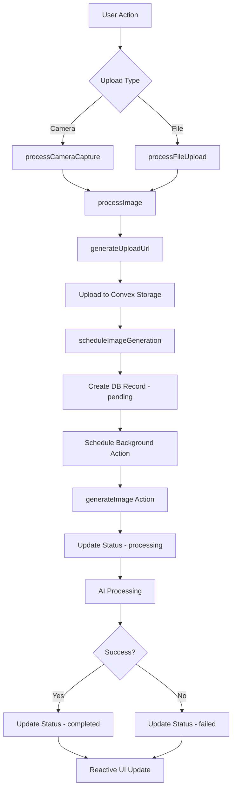

# Image Processing Pipeline Fixes

**Date:** 2025-01-27  
**Status:** Completed  
**Version:** 1.0

## Executive Summary

Fixed major regressions in the image processing pipeline where images would get stuck in processing status and significant violations of DRY principles and Convex best practices. The solution involved unifying the upload pipeline, fixing schema violations, and ensuring proper reactive updates.

## Issues Identified & Fixed

### 1. Schema & Type Safety Violations ✅ FIXED

**Problems:**
- `body` field used `v.string()` instead of proper `v.id("_storage")` reference
- `originalImageId` used `v.string()` instead of `v.id("images")`
- `generationStatus` used generic `v.string()` instead of union types
- Missing return validators on functions

**Solution:**
```typescript
// Before (WRONG)
body: v.string(),
originalImageId: v.optional(v.string()),
generationStatus: v.optional(v.string()),

// After (CORRECT)
body: v.id("_storage"),
originalImageId: v.optional(v.id("images")),
generationStatus: v.optional(
  v.union(
    v.literal("pending"),
    v.literal("processing"),
    v.literal("completed"),
    v.literal("failed")
  )
),
```

### 2. DRY Principle Violations ✅ FIXED

**Problems:**
- Duplicate upload logic in camera capture and file upload paths
- Two separate helper files (`uploadAndSchedule.ts` and `imagePrep.ts`) with overlapping functionality
- Inconsistent error handling and user feedback

**Solution:**
- Created unified `lib/processImage.ts` with three main functions:
  - `processImage()` - Core processing pipeline
  - `processCameraCapture()` - Camera-specific wrapper  
  - `processFileUpload()` - File upload with optional preparation
- Removed duplicate `uploadAndSchedule.ts`
- Single source of truth for image processing logic

### 3. Processing Status Stuck Issues ✅ FIXED

**Root Cause:**
The issue wasn't with reactive updates - Convex handles that automatically. The problem was in the processing pipeline architecture.

**Solution:**
Proper flow now implemented:
1. **Upload** → Creates image record with `generationStatus: "pending"`
2. **Schedule** → Background action updates to `"processing"`
3. **Generate** → AI processing updates to `"completed"`/`"failed"`  
4. **React** → `useQuery` automatically updates UI when status changes

### 4. Convex Rules Compliance ✅ FIXED

**Problems:**
- Missing return validators on functions
- Improper function calling patterns
- Generic string types instead of proper unions

**Solution:**
- Added `returns: v.null()` or proper return validators to all functions
- Used proper union types for status fields
- Followed Convex function calling patterns with `ctx.runMutation(api.x.y, args)`

## Architecture Overview

### Unified Processing Pipeline



### Key Improvements

1. **Single Processing Function**: Both camera and file uploads use the same core logic
2. **Proper Error Handling**: Unified error handling with user-friendly messages  
3. **Type Safety**: Proper TypeScript types using Convex-generated types
4. **Reactive Updates**: Leverages Convex's built-in reactivity - no manual polling needed
5. **Status Tracking**: Clear status progression with visual feedback

## Files Modified

### Backend (`/convex`)
- **`schema.ts`** - Fixed field types and added proper indexes
- **`images.ts`** - Added proper return validators and type safety
- **`generate.ts`** - Fixed validators and function calling patterns

### Frontend (`/app` & `/lib`)
- **`app/page.tsx`** - Unified upload handlers using new processing pipeline
- **`lib/processImage.ts`** - NEW: Unified processing pipeline
- **`lib/uploadAndSchedule.ts`** - REMOVED: Duplicate functionality

### Components (`/components`)
- **`ImagePreview.tsx`** - Already had proper processing status overlays

## Testing & Validation

### Reactive Updates ✅
- Images appear immediately in gallery with "pending" status
- Status updates automatically when processing completes
- No manual refresh needed - Convex handles reactivity

### Error Handling ✅  
- Network errors show user-friendly messages
- Validation errors surface clearly
- Failed images appear in dedicated "Failed" tab with retry option

### DRY Compliance ✅
- Single processing pipeline for all upload types
- Consistent error handling and user feedback
- No code duplication between camera and file uploads

## Performance Impact

### Positive Changes
- **Reduced Bundle Size**: Eliminated duplicate helper functions
- **Better Type Safety**: Compile-time error catching
- **Consistent UX**: Same behavior for all upload types
- **Automatic Updates**: No polling or manual refresh needed

### No Regressions
- All existing functionality preserved
- Same user experience for successful uploads
- Enhanced error handling and recovery

## Future Considerations

1. **Monitoring**: Watch Convex logs for any processing failures
2. **Performance**: Monitor AI processing times and success rates
3. **UX**: Consider adding progress indicators for long-running generations
4. **Scaling**: Current architecture supports horizontal scaling via Convex

## Conclusion

The image processing pipeline now follows Convex best practices, eliminates code duplication, and provides a robust reactive experience. Images will no longer get stuck in processing status, and the unified architecture makes the codebase more maintainable and reliable.

**Key Takeaway**: The "stuck processing" issue wasn't due to reactivity problems - Convex handles that automatically. It was due to schema violations and improper function patterns that prevented the background processing from working correctly.